# 🏛️ Архитектура контейнерного мира

> Глубокое погружение в устройство Docker, containerd, runc и Kubernetes. Все диаграммы — Mermaid, рендерятся в GitHub нативно.

---

## 1. Полный стек: от kubectl до Linux Kernel

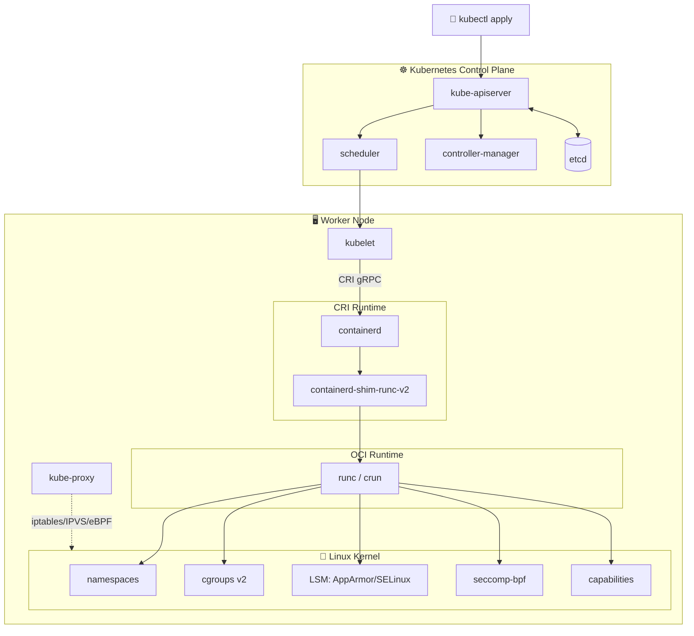

---

## 2. Linux namespaces — изоляция

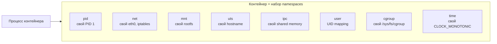

> Проверка: `lsns -p $(pgrep -f myapp)` показывает все namespaces процесса.

---

## 3. cgroups v2 — лимиты ресурсов

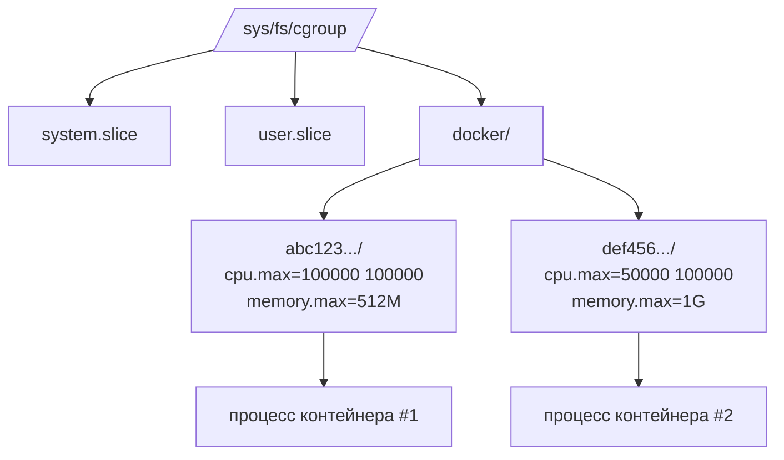

Контроллеры: `cpu`, `memory`, `io`, `pids`, `hugetlb`, `rdma`, `misc`.

---

## 4. Жизненный цикл сборки образа

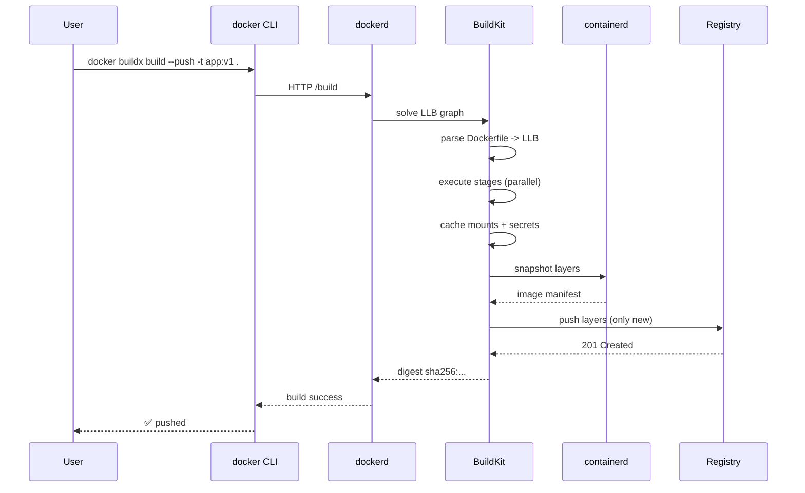

---

## 5. Multi-stage build — оптимизация

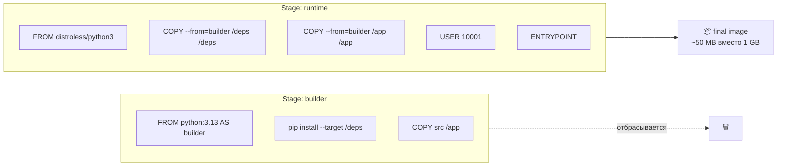

---

## 6. Сеть Docker — bridge режим

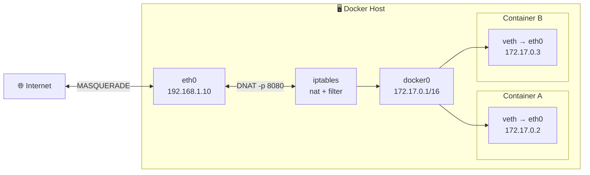

---

## 7. Storage drivers и слои

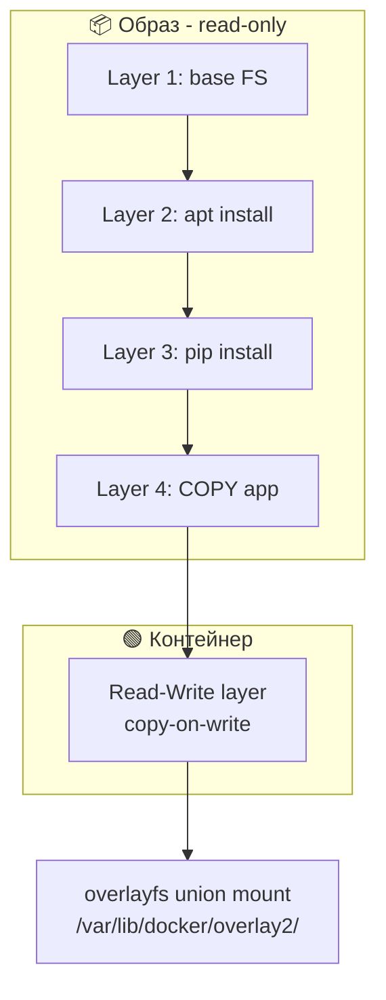

---

## 8. Kubernetes Pod lifecycle

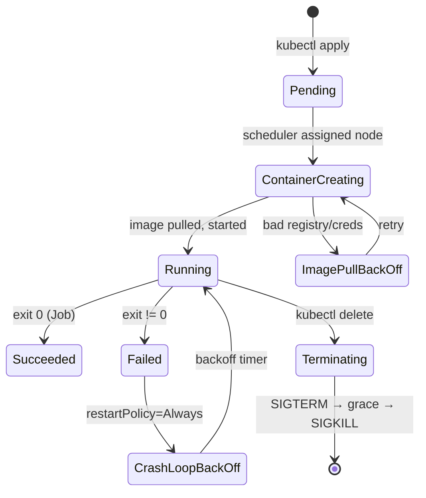

---

## 9. Service discovery в Kubernetes

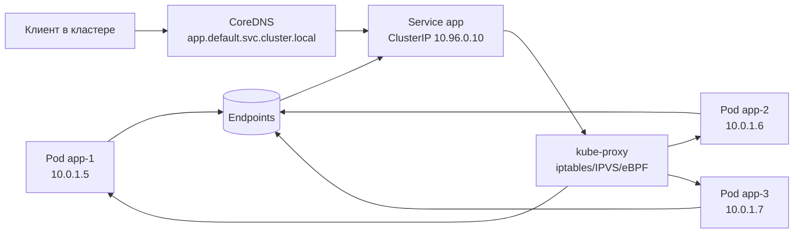

---

## 10. GitOps deployment flow (ArgoCD)

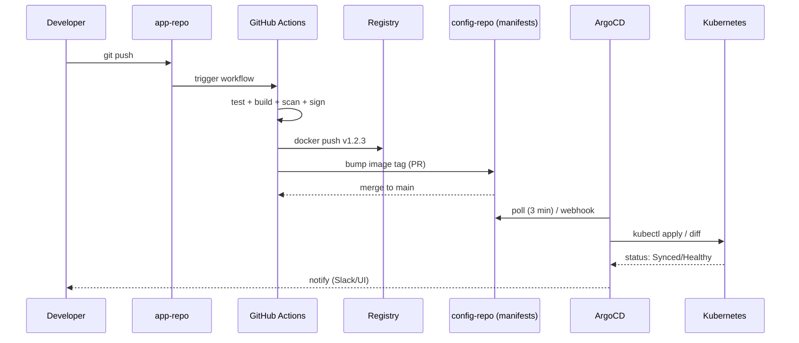

---

## 11. Observability: три столпа

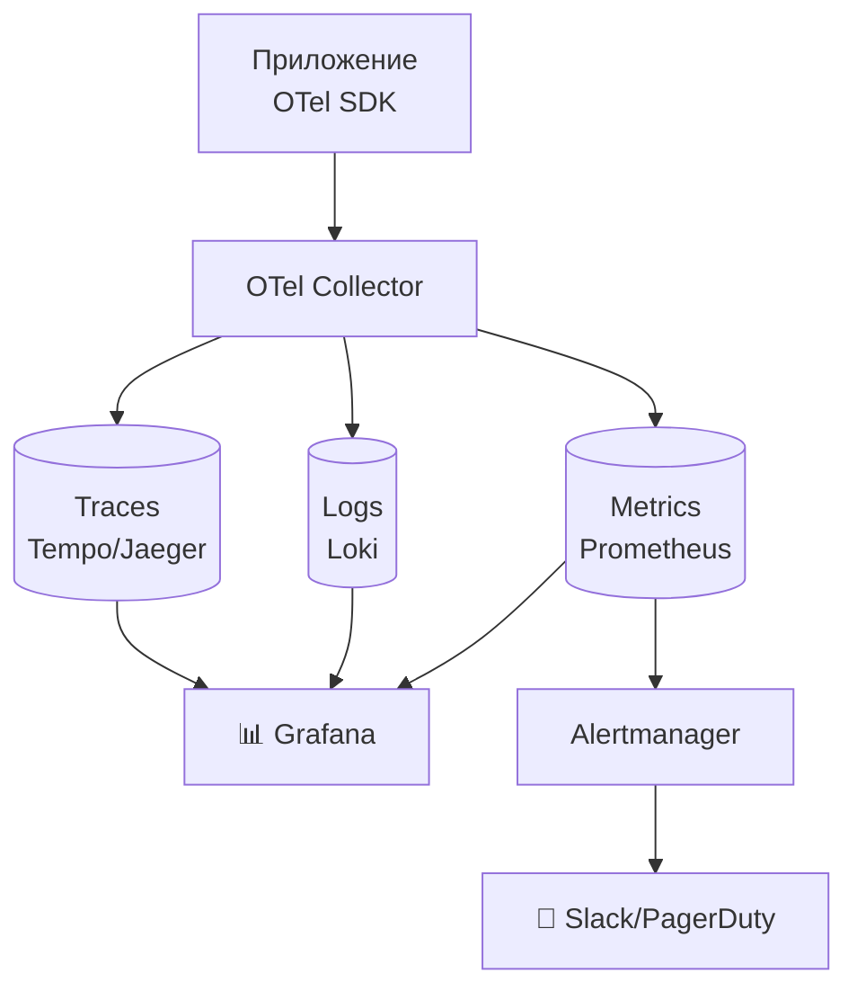

---

## 12. Supply chain security — SLSA

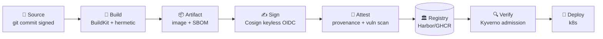

---

## 13. Traffic flow в production

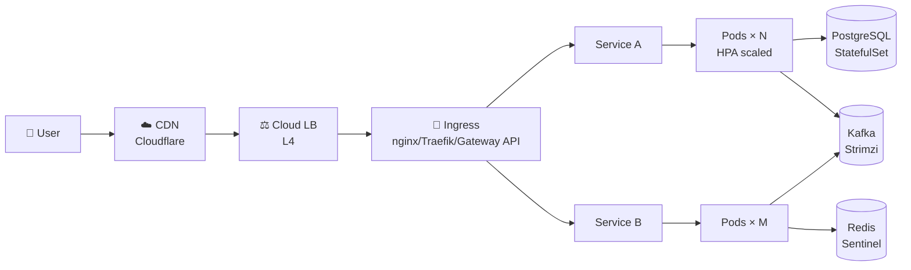

---

## 14. Сравнение runtime

| Runtime | Язык | Особенности | Когда выбрать |
|---------|------|-------------|---------------|
| **runc** | Go | Reference OCI | Дефолт, везде работает |
| **crun** | C | В 10× быстрее runc | HPC, быстрый старт |
| **youki** | Rust | Memory-safe | Безопасность |
| **gVisor** | Go | User-space kernel | Multi-tenant изоляция |
| **Kata** | Go | Lightweight VM | Hardware isolation |
| **Firecracker** | Rust | microVM | Serverless (AWS Lambda) |

---

## 15. Эволюция: от chroot до WASM

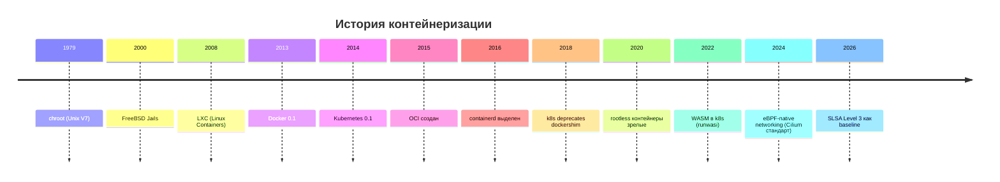

---

> 🔗 [README](README.md) · [MAP](MAP.md) · [stages/](stages/)
