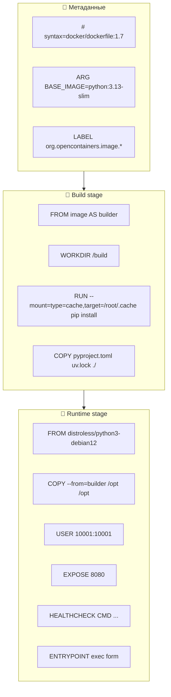
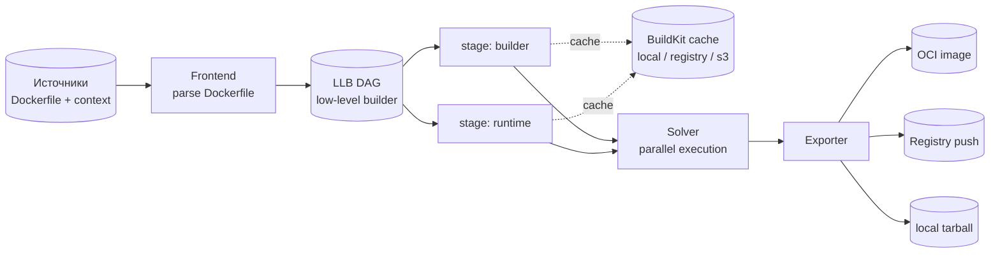
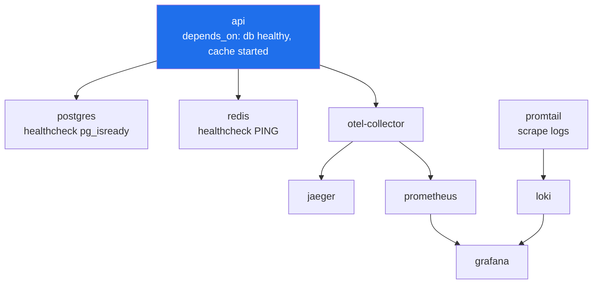
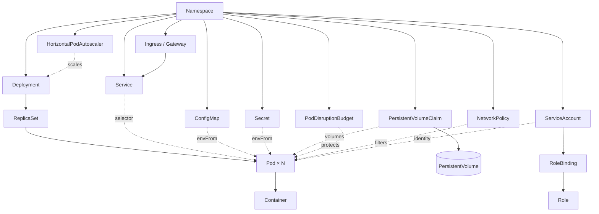
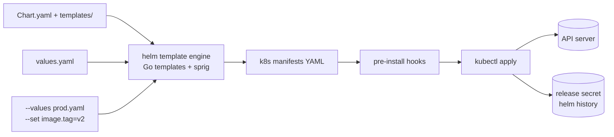
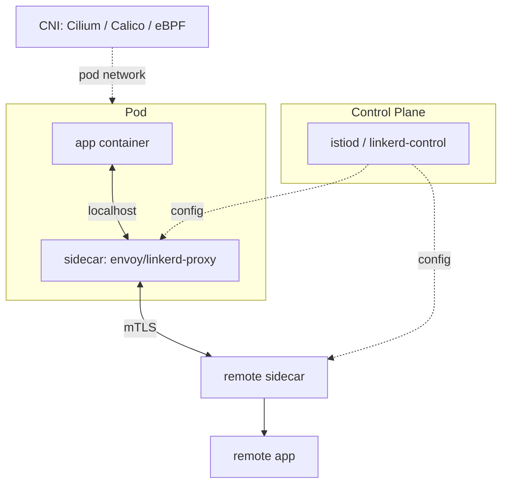
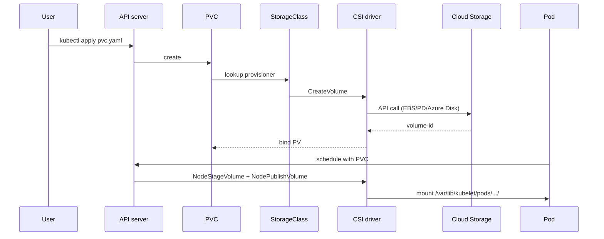
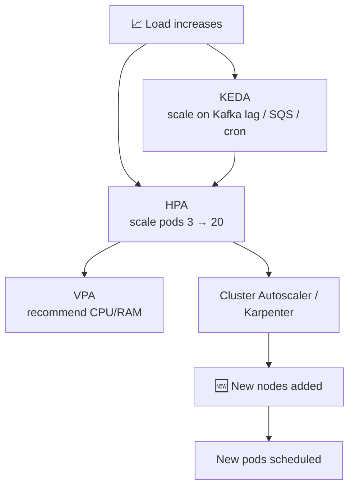
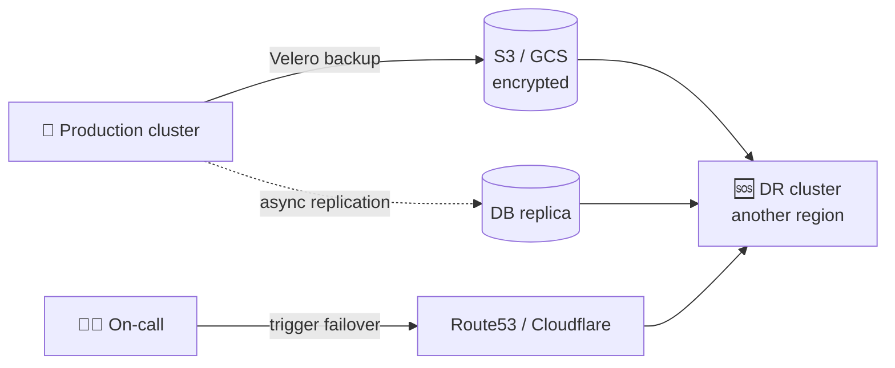
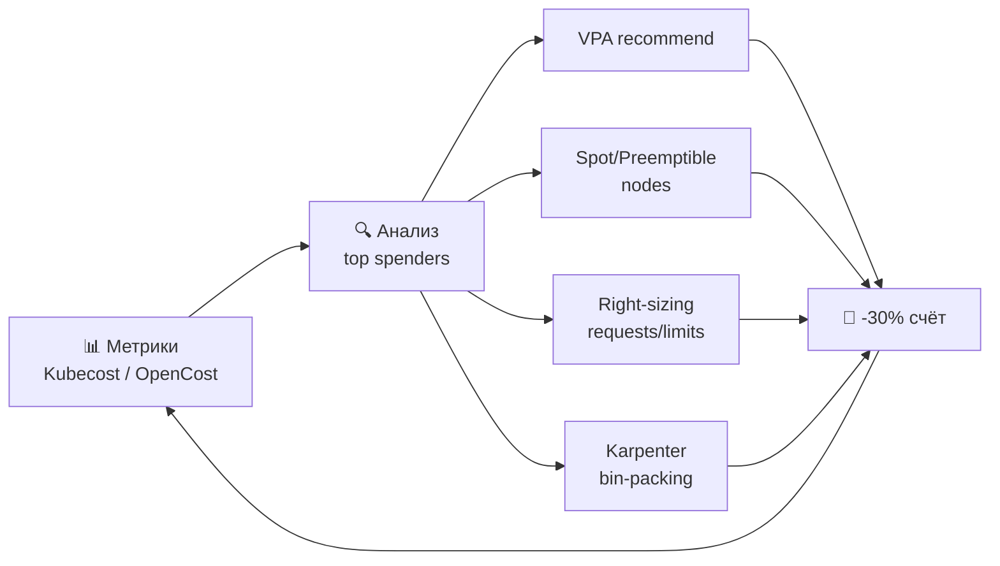

# 📊 Диаграммы и схемы

> Коллекция детальных диаграмм для визуального понимания. Дополняет [MAP.md](MAP.md) и [ARCHITECTURE.md](ARCHITECTURE.md).

## 📑 Содержание

1. [Dockerfile anatomy](#1-dockerfile-anatomy)
2. [BuildKit graph](#2-buildkit-llb-graph)
3. [Compose dependency tree](#3-compose-dependency-tree)
4. [Kubernetes objects map](#4-kubernetes-objects-relationship)
5. [Helm rendering pipeline](#5-helm-rendering-pipeline)
6. [CNI / Service Mesh](#6-cni--service-mesh)
7. [Storage: CSI](#7-storage-csi-flow)
8. [Autoscaling layers](#8-autoscaling-layers)
9. [Disaster recovery](#9-disaster-recovery)
10. [Cost optimization](#10-cost-optimization-loop)

---

## 1. Dockerfile anatomy

**Правила:**
- Порядок инструкций = порядок слоёв. Самые стабильные — выше.
- `COPY pyproject.toml` раньше `COPY . .` — кэш не инвалидируется.
- BuildKit cache mounts — не попадают в образ.

---

## 2. BuildKit LLB graph

---

## 3. Compose dependency tree

**Профили:**

| Profile | Сервисы | Команда |
|---------|----------|---------|
| `core` | api, db, cache | `docker compose --profile core up` |
| `observability` | otel, prom, grafana, loki | `--profile observability` |
| `dev-tools` | pgadmin, redis-commander | `--profile dev-tools` |

---

## 4. Kubernetes objects relationship

---

## 5. Helm rendering pipeline

---

## 6. CNI / Service Mesh

**Сравнение CNI:**

| CNI | Сильные стороны |
|-----|------------------|
| Cilium | eBPF, NetworkPolicy L7, observability (Hubble) |
| Calico | BGP, зрелый, NetworkPolicy |
| Flannel | Простой, для старта |
| Weave | Mesh, устаревает |

---

## 7. Storage CSI flow

---

## 8. Autoscaling layers

**Слои:**
- **HPA** — по CPU/RAM/custom metrics.
- **VPA** — подбор requests/limits.
- **KEDA** — event-driven (Kafka, RabbitMQ, Prometheus query).
- **Cluster Autoscaler / Karpenter** — новые ноды.

---

## 9. Disaster recovery

**Метрики:**
- **RTO** (Recovery Time Objective) — за какое время восстановим.
- **RPO** (Recovery Point Objective) — сколько данных потеряем.
- Цель: RTO ≤ 15 мин, RPO ≤ 5 мин для критичных сервисов.

---

## 10. Cost optimization loop

---

## 🔗 Связанные документы

- [README](README.md) — входная точка
- [MAP](MAP.md) — общий маршрут
- [ARCHITECTURE](ARCHITECTURE.md) — глубокая архитектура
- [stages/](stages/) — этапы 00-07
