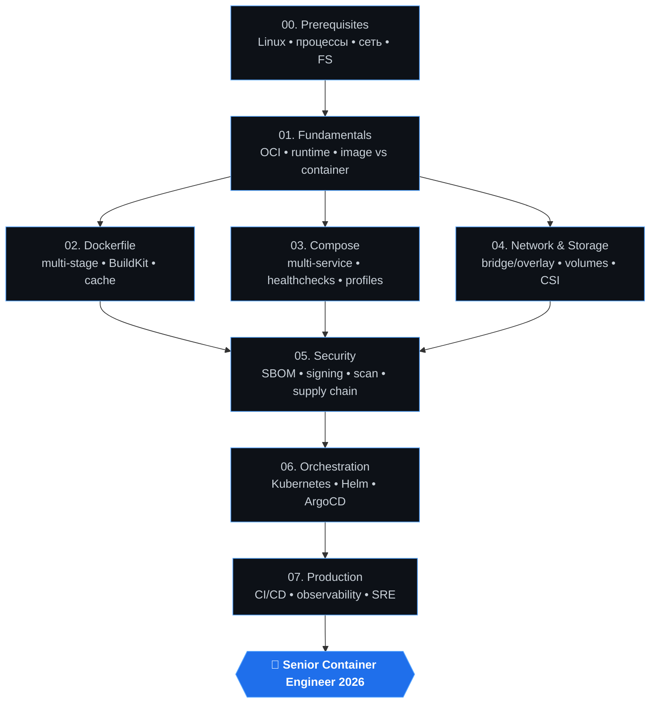
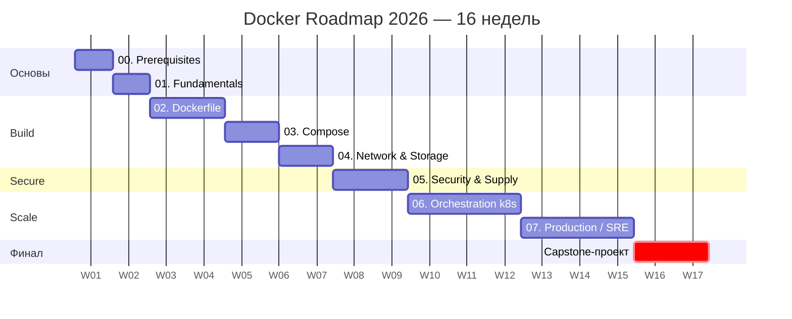
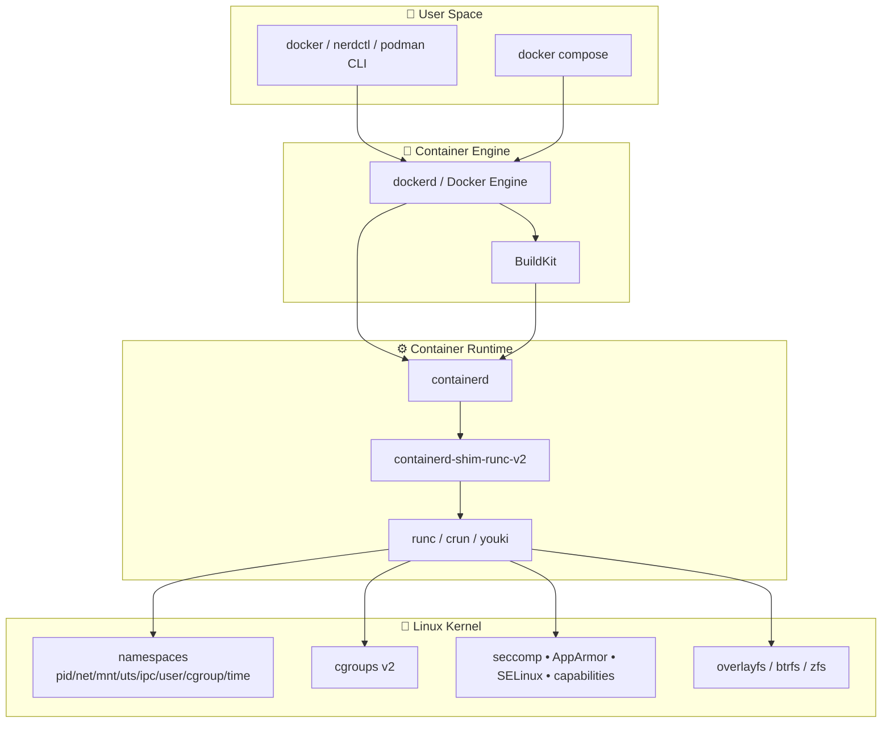
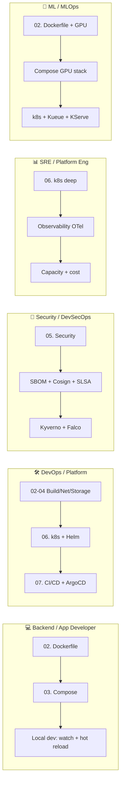
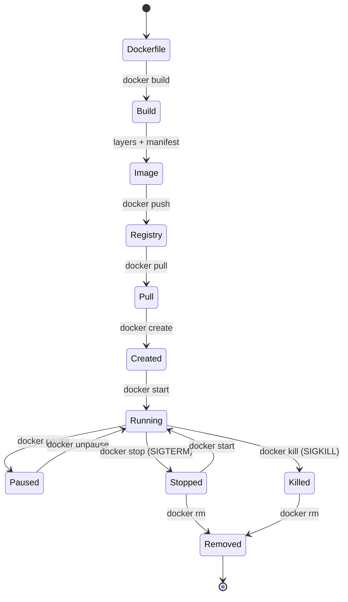
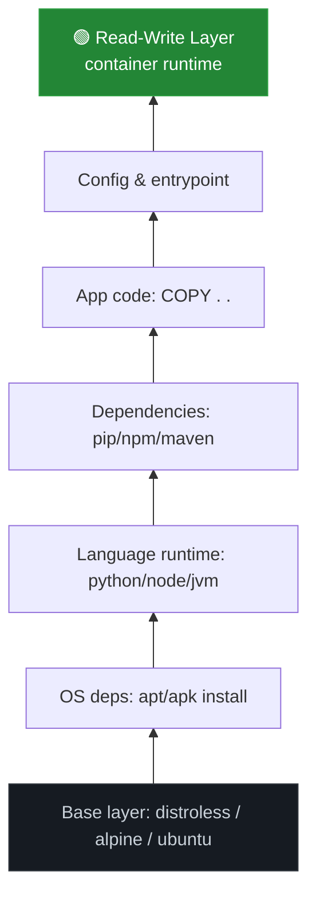
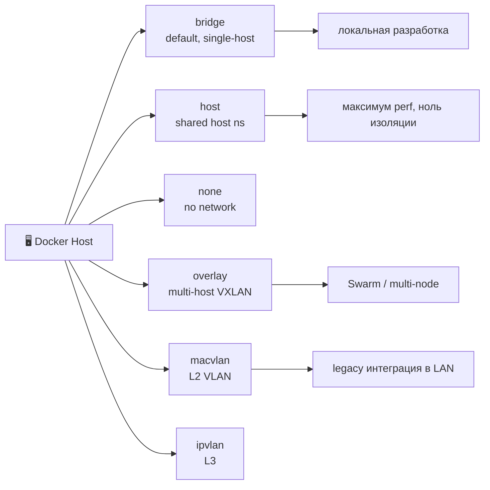
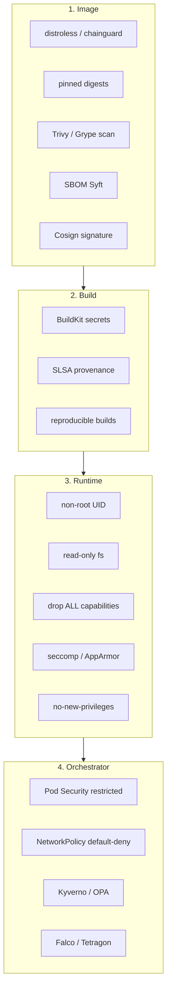
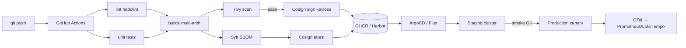
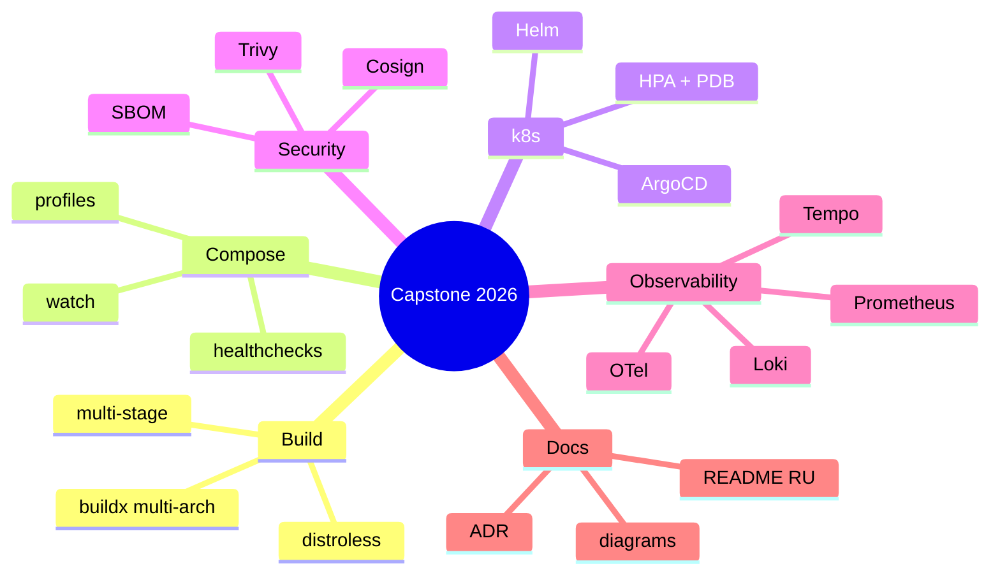

# 🗺️ Карта Docker Roadmap 2026

> Визуальная карта пути от Linux-основ до production Kubernetes. Все диаграммы — на Mermaid (рендерятся прямо в GitHub).

---

## 🧭 Общий маршрут обучения



---

## ⏱️ Таймлайн по неделям



---

## 🏗️ Архитектура контейнерного стека



---

## 🛤️ Треки по ролям



---

## 📊 Сложность и приоритет

| Этап | Сложность | Приоритет | Время | Зависит от |
|------|-----------|-----------|-------|------------|
| 00. Prerequisites | 🟢 Easy | 🔴 Must | 1 нед | — |
| 01. Fundamentals | 🟢 Easy | 🔴 Must | 1 нед | 00 |
| 02. Dockerfile | 🟡 Medium | 🔴 Must | 2 нед | 01 |
| 03. Compose | 🟡 Medium | 🔴 Must | 1.5 нед | 02 |
| 04. Network & Storage | 🟡 Medium | 🟠 Should | 1.5 нед | 01 |
| 05. Security | 🟠 Hard | 🔴 Must | 2 нед | 02,03,04 |
| 06. Orchestration | 🔴 Hard+ | 🟠 Should | 3 нед | 05 |
| 07. Production | 🔴 Hard+ | 🟡 Could | 3 нед | 06 |

---

## 🔄 Lifecycle образа и контейнера



---

## 🧱 Многослойная структура образа



---

## 🌐 Сетевые драйверы



---

## 🔐 Слои безопасности (Defense-in-Depth)



---

## 🚀 Production CI/CD Pipeline



---

## 📚 Где учить — приоритет источников

```mermaid
flowchart TD
    S1[1️⃣ Официальная документация<br/>docs.docker.com • kubernetes.io] --> S2
    S2[2️⃣ Спецификации<br/>OCI • CNCF • Compose Spec] --> S3
    S3[3️⃣ Telegram-каналы RU<br/>@ai_machinelearning_big_data • @pythonl] --> S4
    S4[4️⃣ Бесплатные курсы<br/>KodeKloud • Killercoda • Play with Docker] --> S5
    S5[5️⃣ YouTube<br/>TechWorld with Nana • Bret Fisher • DevOps Toolkit] --> S6
    S6[6️⃣ Книги (free)<br/>Docker Deep Dive • Kubernetes Up & Running] --> S7
    S7[7️⃣ Практика<br/>Capstone-проект на GitHub]
```

---

## 🎯 Capstone-проект (финальный артефакт)

Собрать в одном репозитории все навыки:

1. **Микросервис** (Python/Go/Node) с multi-stage Dockerfile на distroless.
2. **docker-compose.yml** с api+postgres+redis+otel-collector+jaeger+prometheus+grafana.
3. **Helm-чарт** с HPA, PDB, NetworkPolicy, restricted PodSecurity.
4. **GitHub Actions**: build → scan → sign → SBOM → attest → push → ArgoCD sync.
5. **Observability**: OTel-инструментирование + дашборд Grafana + алёрты.
6. **README** на русском, MIT-лицензия, скриншоты, ADR-документы.



---

## ✅ Чек-лист «готов к Senior»

- [ ] Понимаю разницу между namespaces, cgroups, capabilities.
- [ ] Пишу Dockerfile с multi-stage, BuildKit cache mounts, secrets.
- [ ] Знаю Compose v2 spec наизусть (profiles, watch, healthcheck).
- [ ] Запускаю Trivy + Syft + Cosign в CI.
- [ ] Деплою через Helm + ArgoCD с canary/blue-green.
- [ ] Настраиваю OTel → Prometheus/Loki/Tempo.
- [ ] Дебажу CrashLoopBackOff, OOMKilled, ImagePullBackOff вслепую.
- [ ] Снижаю размер образа в 5-10 раз через distroless / chainguard.
- [ ] Подписываю образы Cosign keyless (OIDC) и проверяю в admission.

---

> 🔗 Связанные документы: [README](README.md) • [stages/](stages/) • [templates/](templates/) • [prompts/](prompts/) • [cheatsheets/](cheatsheets/)
