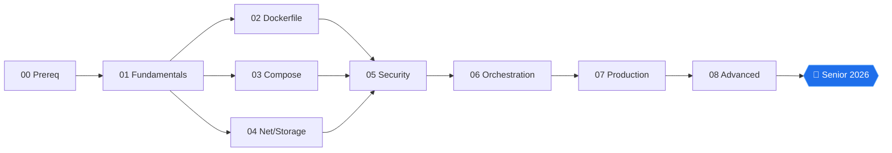

# 🐳 Docker Roadmap 2026

> Полный и подробный роадмап по Docker и контейнеризации на 2026 год. Только бесплатные ресурсы, актуальный стек, фокус на production-практику.

   

---

## 🗺️ Навигация

| Документ | О чём |
|----------|--------|
| **[MAP.md](MAP.md)** | Визуальная карта с Mermaid-диаграммами, Gantt-таймлайн, mindmap |
| **[ARCHITECTURE.md](ARCHITECTURE.md)** | Глубокая архитектура (15 разделов: kernel → k8s) |
| **[DIAGRAMS.md](DIAGRAMS.md)** | 10 визуальных диаграмм (Dockerfile, BuildKit, k8s objects, CSI) |
| **[COMPARISONS.md](COMPARISONS.md)** | 13 сравнительных таблиц (engines, base, CI, GitOps, ...) |
| **[stages/](stages/)** | 9 этапов обучения (00—08) |
| **[templates/](templates/)** | Production-ready starter шаблоны |
| **[prompts/](prompts/)** | LLM-промпты для code review, slim, audit |
| **[cheatsheets/](cheatsheets/)** | Быстрые справочники (docker, kubectl, Compose) |

---

## 🎯 Для кого этот роадмап

- 👩‍💻 **Backend / fullstack** — хочешь уверенно писать Dockerfile и docker-compose.
- 🛠️ **DevOps / Platform Engineer** — выстраиваешь CI/CD, k8s, GitOps.
- 🔐 **Security / DevSecOps** — подпись, SBOM, supply chain.
- 📊 **SRE** — обсервабельность, capacity, cost.
- 🧠 **ML / MLOps** — GPU workloads, KServe, Kueue.

---

## 🗺️ Общий путь (кратко)



→ более подробные схемы в [MAP.md](MAP.md).

---

## 📘 Этапы

1. [00. Prerequisites](stages/00-prerequisites.md) — Linux основы, namespaces, cgroups, capabilities.
2. [01. Fundamentals](stages/01-fundamentals.md) — OCI, runtime stack, image vs container.
3. [02. Dockerfile](stages/02-dockerfile.md) — multi-stage, BuildKit, cache mounts, distroless.
4. [03. Compose](stages/03-compose.md) — v2 spec, profiles, healthchecks, watch.
5. [04. Network & Storage](stages/04-networking-storage.md) — bridge/overlay, volumes, CSI.
6. [05. Security](stages/05-security.md) — SBOM, Cosign, SLSA, Kyverno, Falco.
7. [06. Orchestration](stages/06-orchestration.md) — Kubernetes, Helm, ArgoCD.
8. [07. Production](stages/07-production.md) — CI/CD, OTel, troubleshooting.
9. [08. Advanced](stages/08-advanced.md) — eBPF, WASM, service mesh, multi-cluster, GPU.

---

## 📦 Минимальный стек 2026 (весь бесплатный)

| Категория | Инструмент |
|-----------|-------------|
| **Build** | Docker buildx + BuildKit |
| **Base image** | `distroless` или `chainguard/static` |
| **Registry** | GHCR (GitHub Container Registry) |
| **Local k8s** | `kind` / `k3d` |
| **CI/CD** | GitHub Actions |
| **GitOps** | Argo CD |
| **Scan** | Trivy + Syft + Grype |
| **Sign** | Cosign (keyless OIDC) |
| **Policy** | Kyverno |
| **Mesh** | Linkerd или Cilium Service Mesh |
| **Ingress** | Gateway API + Envoy Gateway |
| **Secrets** | External Secrets Operator |
| **Observability** | OTel + Prometheus + Loki + Tempo + Grafana |

→ полное сравнение альтернатив: [COMPARISONS.md](COMPARISONS.md).

---

## 📚 Где учить (приоритетные источники)

### 1️⃣ Официальная документация

- [docs.docker.com](https://docs.docker.com/) — Docker.
- [kubernetes.io](https://kubernetes.io/docs/) — Kubernetes.
- [opencontainers.org](https://opencontainers.org/) — OCI спецификации.
- [compose-spec.io](https://compose-spec.io/) — Compose v2.

### 2️⃣ Telegram (русскоязычные)

1. **[@ai_machinelearning_big_data](https://t.me/ai_machinelearning_big_data)** — ML/DevOps новости.
2. **[@pythonl](https://t.me/pythonl)** — Python + инфра.
3. **[Папка каналов](https://t.me/addlist/8vDUwYRGujRmZjFi)** — подборка.

### 3️⃣ Бесплатные курсы

- [KodeKloud Free Labs](https://kodekloud.com/courses/) — Docker + k8s playground.
- [Play with Docker](https://labs.play-with-docker.com/) — sandbox в браузере.
- [Killercoda](https://killercoda.com/) — сценарии k8s/Docker.
- [Cilium Labs](https://isovalent.com/labs/) — eBPF и networking.

### 4️⃣ YouTube

- **TechWorld with Nana** — k8s и DevOps бесплатные курсы.
- **Bret Fisher** — Docker eksperto.
- **DevOps Toolkit** (Viktor Farcic) — сравнения инструментов.

### 5️⃣ Книги (free / open access)

- *Docker Deep Dive* — Nigel Poulton.
- *Kubernetes Up & Running* — Kelsey Hightower (free chapters).
- *Container Security* — Liz Rice.
- *Learning eBPF* — Liz Rice ([репозиторий](https://github.com/lizrice/learning-ebpf)).

---

## 🎯 Capstone-проект

Собрать в одном репо:

1. Микросервис с multi-stage Dockerfile на `distroless`.
2. `docker-compose.yml` с polnym stack (api+db+cache+otel+jaeger+prom+grafana).
3. Helm-чарт с HPA, PDB, NetworkPolicy, PodSecurity=restricted.
4. GitHub Actions: build → scan → sign → SBOM → attest → push → ArgoCD.
5. OTel-инструментирование + Grafana dashboard + alerts.
6. README RU + ADR + diagrams.

→ детали в [MAP.md → Capstone](MAP.md#-capstone-проект-финальный-артефакт).

---

## 📁 Структура репозитория

```
Docker-Roamap-2026/
├── README.md              ← вы здесь
├── MAP.md                 — визуальная карта (Mermaid + Gantt)
├── ARCHITECTURE.md        — глубокая архитектура
├── DIAGRAMS.md            — доп диаграммы
├── COMPARISONS.md         — выбор инструментов
├── stages/                — 9 этапов обучения
├── templates/             — starter-шаблоны
│   ├── docker-starter/
│   ├── compose-starter/
│   ├── k8s-starter/
│   ├── helm-starter/
│   └── ci-starter/
├── prompts/               — LLM промпты
└── cheatsheets/           — быстрые справочники
```

---

## 📝 Лицензия

MIT — берите, форкайте, улучшайте. PR приветствуются.

---

> Обновлёно: 2026 • Ряд объёмов: 9 этапов, 5 шаблонов, 5+ промптов, 4+ cheatsheets, 4 обзорных документа.
